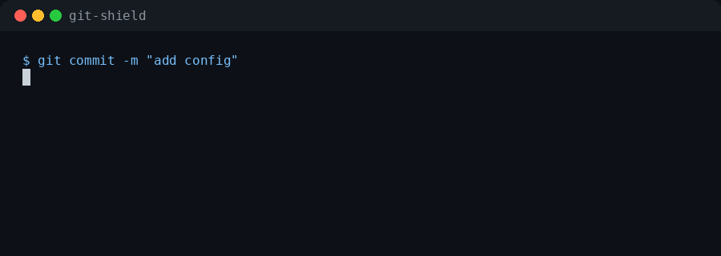

# Git Shield

[](https://github.com/vekexasia/git-shield/actions)
[](https://www.python.org/)
[](LICENSE)

A local Git safety net for vibe coding. Git Shield blocks API keys, secrets, and contextual PII before code leaves your machine.

It is meant for projects where AI-generated edits, copied logs, quick experiments, support snippets, or test fixtures can accidentally introduce sensitive data.



## Why Git Shield?

When you use AI coding assistants, copy-paste from logs, or quickly iterate on code, it is easy to accidentally commit real email addresses, API keys, phone numbers, or personal names. Standard secret scanners catch API keys but miss contextual PII. Git Shield combines both:

- **Secrets** via `gitleaks` -- API keys, tokens, credentials, private keys
- **PII** via [OpenAI Privacy Filter](https://github.com/openai/privacy-filter) -- emails, phone numbers, names, addresses

It runs locally. No source code leaves your machine.

## Quick install

Requirements: Python 3.11+, Git, [`uv`](https://docs.astral.sh/uv/), `gitleaks` on PATH.

Platforms: Linux, macOS, and WSL (Windows Subsystem for Linux). Native Windows is not supported -- use WSL.

```bash
# Install Git Shield
git clone https://github.com/vekexasia/git-shield
cd git-shield
uv tool install -e .

# Install OpenAI Privacy Filter (PII scanning)
git clone https://github.com/openai/privacy-filter ../privacy-filter
uv tool install -e ../privacy-filter

# Verify everything works
git-shield doctor --smoke
```

### No GPU?

PII scanning works on CPU for small diffs. The default config already handles this:

```bash
# Works out of the box -- falls back to CPU for diffs under 16KB
git-shield install --global --force
```

For larger diffs on CPU, set `cuda_policy = "skip"` in `git-shield.toml` to skip PII scanning when CUDA is unavailable, or keep `cpu-small` (the default) to scan small diffs on CPU.

### One-step guided setup

```bash
git-shield bootstrap --smoke --force
```

This runs `doctor`, writes starter config files, and installs global hooks.

## Copy-paste prompt for your coding agent

```text
Install Git Shield from https://github.com/vekexasia/git-shield.
Use uv. Install the git-shield CLI with `uv tool install -e .` from the clone.
Ensure `gitleaks` is available on PATH.
Install OpenAI Privacy Filter from https://github.com/openai/privacy-filter with `uv tool install -e ../privacy-filter`.
Run `git-shield doctor --smoke` to verify.
If doctor passes, run `git-shield install --global --force`.
Do not print any real secrets or PII in the chat.
```

## How it works

```text
git commit
  └─ pre-commit hook
       └─ git-shield secrets --staged
            └─ gitleaks (regex) ── blocks API keys/secrets

git push
  └─ pre-push hook
       └─ git-shield prepush
            ├─ resolves pushed refs and base commits
            ├─ extracts added lines from outgoing diffs
            ├─ skips ignored/binary/lock files
            ├─ gitleaks ── blocks secrets
            └─ OpenAI Privacy Filter ── blocks PII
```

PII scanning runs at pre-push (not pre-commit) because OPF is heavier than regex scanning. Pre-push catches leaks before they leave your machine without slowing every commit.

## CLI

```bash
git-shield --version                           # print version
git-shield doctor                              # check dependencies
git-shield doctor --smoke                      # run synthetic smoke tests
git-shield doctor --install                    # auto-install missing dependencies
git-shield doctor --check-updates             # check latest gitleaks release
git-shield doctor --json                       # machine-readable output
git-shield status --global                     # show hooks and dependencies
git-shield status --global --json              # machine-readable hook status
git-shield bootstrap --smoke --install-deps    # doctor + auto-install + init + global install
git-shield init                                # write starter config files
git-shield secrets --staged                    # scan staged additions (secrets only)
git-shield scan --base origin/main             # scan a diff range
git-shield scan --stdin --device cpu           # scan stdin
git-shield scan --json                         # JSON output
git-shield scan --backend gliner               # use GLiNER instead of OPF
git-shield scan --no-cache                     # bypass scan result cache
git-shield audit --all-files                   # scan repo files
git-shield install --global --force            # install global hooks
git-shield uninstall --global                  # remove global hooks
```

Subcommands: `scan`, `prepush`, `secrets`, `doctor`, `status`, `bootstrap`, `audit`, `init`, `install`, `uninstall`.

### Exit codes

| Code | Meaning |
|------|---------|
| 0 | Clean -- no findings |
| 1 | Error (missing dependency, OPF failure, etc.) |
| 2 | Secrets found |
| 3 | PII found |
| 4 | Both secrets and PII found |

Use `--json` to get structured output with finding details.

## Hook installation details

**Global install:**

```bash
git-shield install --global --force
```

Writes `~/.githooks/pre-commit` and `~/.githooks/pre-push`, then sets `git config --global core.hooksPath ~/.githooks`.

**Local install:**

```bash
git-shield install --force
```

Writes `.git/hooks/pre-commit` and `.git/hooks/pre-push`.

Safety behavior:

- Without `--force`, existing hooks are never overwritten.
- With `--force`, different existing hooks are backed up as `pre-commit.bak.<timestamp>`.
- `git-shield uninstall` refuses to remove hooks it did not install.
- `git-shield uninstall` restores the latest backup when available.

## Configuration

```bash
git-shield init   # writes git-shield.toml and .pii-allowlist
```

Example `git-shield.toml`:

```toml
[git_shield]
device = "cuda"
cuda_policy = "cpu-small"   # fail | skip | cpu-small
backend = "opf"              # opf | gliner
cpu_small_threshold = 16384
opf_bin = "opf"
gitleaks_bin = "gitleaks"
timeout_seconds = 180
max_bytes_per_chunk = 65536
max_total_bytes = 2097152
labels = ["private_email", "private_phone", "private_person", "secret"]
ignore_globs = ["*.lock", "*.png", "vendor/*", "tests/fixtures/*"]
allowlist_paths = [".pii-allowlist"]
```

Allow public/test values with narrow regexes in `.pii-allowlist`:

```text
(?i)^support@example\.com$
(?i)^user\d+@test\.com$
(?i)^git@github\.com$
```

Also checks `~/.githooks/pii-allowlist.txt` and extra paths in `allowlist_paths`. Config values are validated at startup; invalid backends, CUDA policies, non-positive size limits, or malformed string lists fail with a config error before scanning.

## pre-commit framework

```yaml
repos:
  - repo: https://github.com/vekexasia/git-shield
    rev: v0.1.0
    hooks:
      - id: git-shield-secrets
        stages: [pre-commit]
      - id: git-shield
        stages: [pre-push]
```

Make sure `gitleaks` and `opf` are available on PATH.

## What it catches

**Secrets** (via gitleaks): API keys, tokens, credentials, private keys, provider-specific formats.

**PII** (via OpenAI Privacy Filter): `private_email`, `private_phone`, `private_person`, `private_address`, `private_url`, `private_date`, `account_number`, `secret`.

## What it does not guarantee

Git Shield is a guardrail, not a compliance product.

- It can miss sensitive data.
- It can false-positive on fixtures or public contact information.
- It only scans what Git exposes in staged additions or outgoing diffs.
- New branch base resolution depends on available local refs.
- You can bypass hooks with Git's `--no-verify`.

## Bypass and recovery

```bash
# Bypass only when you know the finding is safe
git commit --no-verify
git push --no-verify

# Prefer allowlisting narrow values instead
# Remove hooks installed by Git Shield
git-shield uninstall --global
git-shield uninstall
```

## Auto-install dependencies

`git-shield doctor --install` attempts to download and install missing dependencies. With `--check-updates`, it can also update an outdated gitleaks install:

```bash
git-shield doctor --install --check-updates
```

For a full guided setup including auto-install:

```bash
git-shield bootstrap --smoke --install-deps --force
```

## GLiNER backend

For faster CPU-friendly PII detection, you can use [GLiNER](https://github.com/urchade/GLiNER) instead of OpenAI Privacy Filter:

```bash
pip install gliner
git-shield scan --backend gliner --stdin
```

Or set it in `git-shield.toml`:

```toml
backend = "gliner"
device = "cpu"
```

GLiNER is lighter than OPF (uses a BERT-based model vs the full OPF model) and runs well on CPU. It detects the same PII categories.

## Scan result caching

Git Shield caches clean scan results to avoid re-scanning unchanged files. The cache is stored in `.git/git-shield-cache.json` and auto-expires after 7 days. Cache entries are keyed by scanned content plus relevant scanner configuration, labels, limits, and allowlist file state, so changing policy invalidates old clean results.

```bash
# Bypass cache for one scan
git-shield scan --no-cache
```

## Troubleshooting

**OPF is slow on CPU** -- Set `cuda_policy = "skip"` to disable PII scanning, or use `--backend gliner` for a lighter CPU-friendly model.

**gitleaks not found** -- Install from https://github.com/gitleaks/gitleaks#installing and ensure it is on PATH.

**Hook not firing** -- Run `git-shield status --global` to check hook installation. Ensure `core.hooksPath` is set correctly.

**False positives** -- Add narrow regex patterns to `.pii-allowlist`. Prefer specific patterns over broad skips.

**Windows** -- Native Windows is not supported. Use WSL (Windows Subsystem for Linux).

## Comparison with alternatives

| Tool | Secrets | PII | Local-first | Git hooks |
|------|---------|-----|-------------|-----------|
| **Git Shield** | gitleaks | OPF or GLiNER | Yes | pre-commit + pre-push |
| gitleaks | Yes | No | Yes | pre-commit |
| detect-secrets | Yes | No | Yes | pre-commit |
| trufflehog | Yes | No | Yes | pre-commit |
| Git Shield adds contextual PII detection (emails, names, phones) that regex-based tools miss. |

## Development

```bash
git clone https://github.com/vekexasia/git-shield
cd git-shield
python3 -m venv .venv
. .venv/bin/activate
pip install -e '.[dev]'
pytest
uv build
```

Model/backend evaluation notes are in [`MODEL_EVAL.md`](MODEL_EVAL.md).

## Security notes

- Hook output is printed to stderr and is visible in normal Git command output.
- Secrets are redacted by gitleaks before display.
- PII is redacted by Git Shield before display.
- OPF chunks are scanned through temporary files. Temp files use Python's private tempfile defaults and are removed when scanning completes.
- Do not put real secrets or real PII in issues, tests, fixtures, or chat logs.

If you find a path that prints raw sensitive values, report it as a security bug. See [`SECURITY.md`](SECURITY.md).
